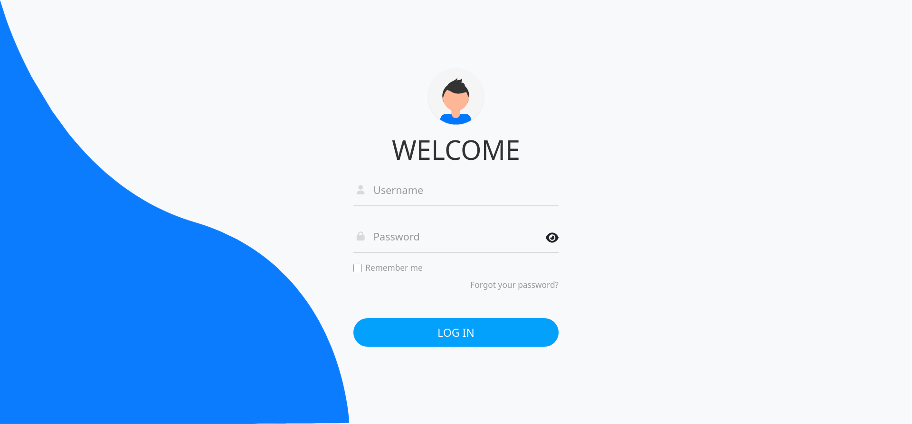
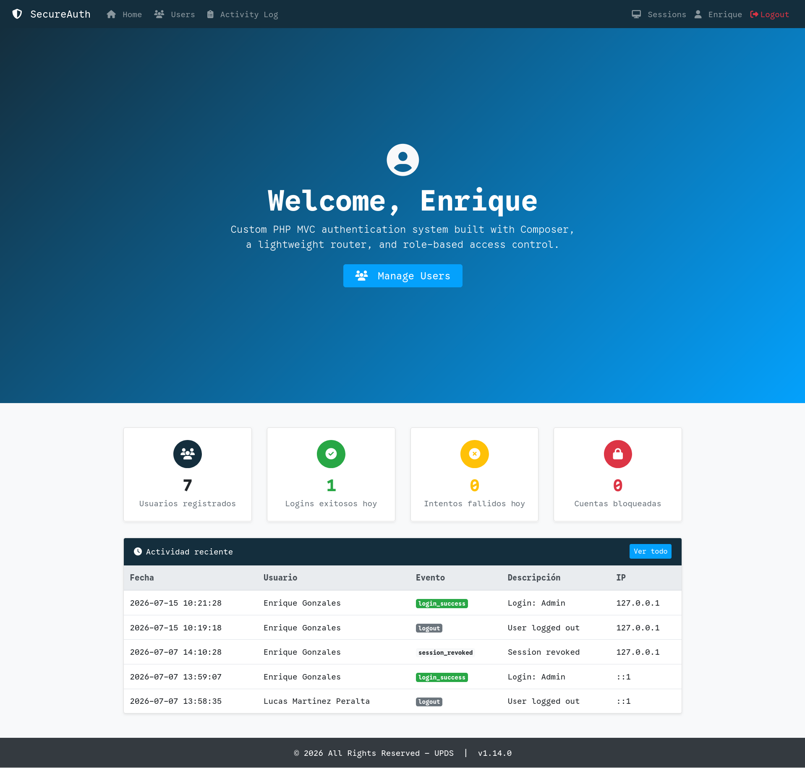
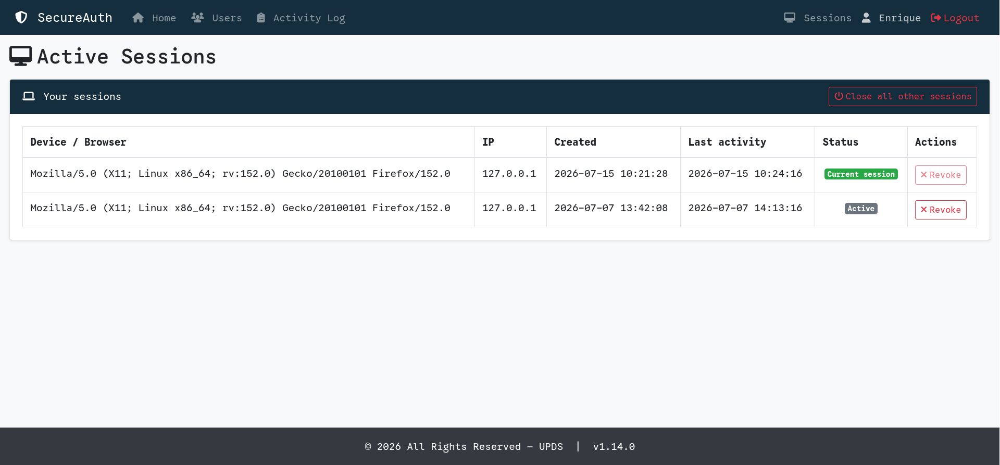
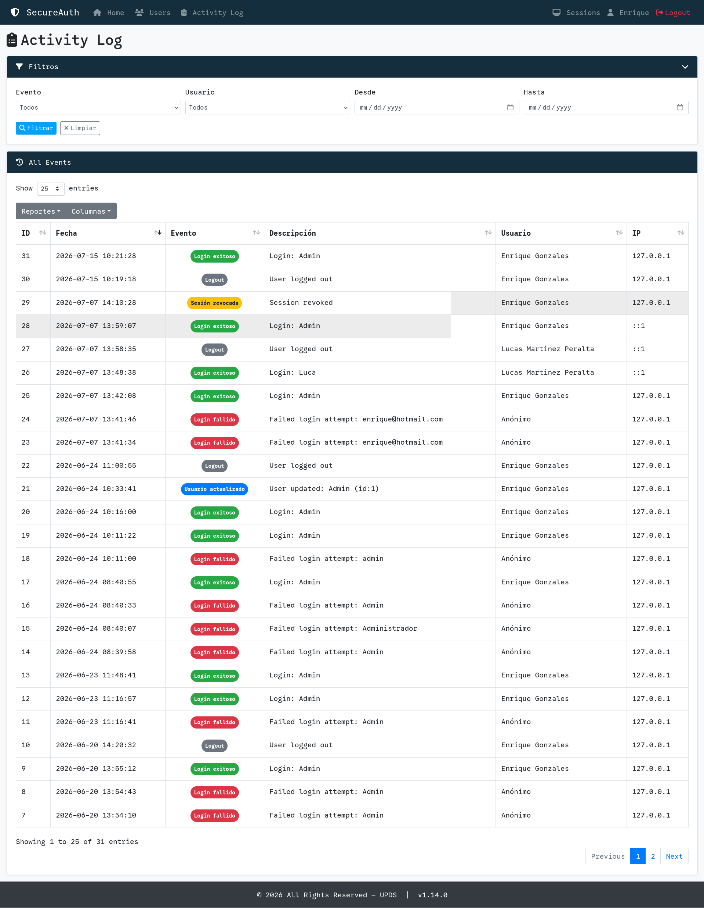

<div align="center">

# SecureAuth — PHP MVC Authentication System

[](https://github.com/jandrescodes/Encriptacion_PHP/releases/tag/1.14.1)
[](https://github.com/jandrescodes/Encriptacion_PHP/actions/workflows/tests.yml)
[](https://php.net/)
[](https://github.com/PHPMailer/PHPMailer)
[](LICENSE)

Custom PHP MVC authentication system built with Composer, a lightweight router, and role-based access control.

</div>

## Table of Contents

- [Screenshots](#screenshots)
- [Features](#features)
- [Requirements](#requirements)
- [Installation](#installation)
- [Project Structure](#project-structure)
- [Usage](#usage)
- [URL Routing](#url-routing)
- [Security](#security)
- [Cache](#cache)
- [Testing](#testing)
- [Contributing](#contributing)
- [License](#license)

## Screenshots

### Login

Secure login form with account lockout and password recovery.



---

### Dashboard

Live metrics — total users, logins today, failed attempts, and locked accounts — plus a feed of recent audit events.



---

### Active Sessions

Every active login, with device/browser and IP, and the ability to revoke individual sessions or all but the current one.



---

### Activity Log

Full audit trail with server-side filtering by event type, username, and date range.



## Features

**Authentication & Account Management**
- Login with bcrypt password hashing, account lockout after repeated failed attempts, and email-based password recovery
- Persistent login (Remember Me) and automatic session timeout on inactivity
- Self-service user profile — edit personal info or change password at `/profile`

**Administration**
- Full user CRUD with role-based access control
- Active sessions management — view and revoke logins per device at `/sessions`
- Audit log of security and admin events, filterable and exportable, at `/activity-logs`
- Dashboard with live metrics — total users, logins today, failed attempts, locked accounts

**Architecture & Tooling**
- Custom MVC core (`App\Core\Router`, `Controller`, `Model`) with PSR-4 autoloading via Composer
- File-based cache for the users listing, with automatic invalidation on writes
- DataTables-powered tables with export (Copy, PDF, Excel, CSV, Print) and column visibility toggle
- SweetAlert2 notifications for CRUD and authentication feedback
- 71-test PHPUnit integration suite running against a real MySQL database, with CI via GitHub Actions

> See [Security](#security) below for how each of these is implemented under the hood.

## Requirements

- PHP >= 8.2
- MySQL / MariaDB
- Apache with `mod_rewrite` (XAMPP recommended)
- Composer
- Gmail account with an App Password (or any SMTP provider)

## Installation

1. Clone the repository:

```bash
git clone https://github.com/jandrescodes/Encriptacion_PHP.git
cd Encriptacion_PHP
```

2. Install dependencies:

```bash
composer install
```

3. Copy and configure the environment file:

```bash
cp .env.example .env
```

Edit `.env` with at least your DB credentials and SMTP settings (see `.env.example` for the full list of variables and defaults).

4. Import the database schema:

```bash
mysql -u root -p < database/schema.sql
```

5. (Optional) Load sample data:

```bash
mysql -u root -p < database/seeds.sql
```

6. Place the project in your server's web root (e.g. `htdocs/` in XAMPP) and open `APP_URL` in your browser.

## Project Structure

```
├── app/            # MVC core — Config, Controller, Core, Middleware, Model, Service
├── database/        # Schema, test schema, and seed data
├── libs/            # File-based cache implementation
├── public/           # Web root — front controller, CSS/JS/fonts, .htaccess
├── routes/           # Route definitions
├── storage/          # Runtime cache (not web-accessible)
├── views/            # PHP views, grouped by feature; shared layouts in views/layouts/
├── tests/            # PHPUnit unit + integration suite
├── .env.example      # Environment variable template
├── phpunit.xml       # PHPUnit configuration
└── composer.json     # Dependencies and PSR-4 autoload
```

See [CLAUDE.md](CLAUDE.md) for the full file-by-file breakdown.

## Usage

1. Open `http://localhost/Encriptacion_PHP/public/` in your browser
2. Log in with a seeded user (e.g. username `Admin`, password `Admin1234`)
3. Click your username in the nav to access your **profile** — edit info or change password
4. Visit `/sessions` to view your active sessions and revoke any device individually or all-but-current
5. Admin users (`is_admin = 1`) see the **Users** and **Activity Log** links in the nav → full CRUD and audit history
6. To recover a password, click "Forgot your password?" on the login page

## URL Routing

All routes are declared in `routes/web.php` and dispatched by `App\Core\Router`:

| URL                            | Controller method                     |
| ------------------------------ | ------------------------------------- |
| `/`                            | `HomeController::index()`             |
| `/login`                       | `AuthController::login()`             |
| `POST /logout`                 | `AuthController::logout()`            |
| `/forgot-password`             | `AuthController::forgotPassword()`    |
| `/reset-password?token=...`    | `AuthController::resetPassword()`     |
| `/profile`                     | `ProfileController::profile()`        |
| `POST /profile/password`       | `ProfileController::changePassword()` |
| `/users`                       | `UserController::index()`             |
| `/users/create`                | `UserController::create()`            |
| `/users/edit?id=X`             | `UserController::edit()`              |
| `POST /users/delete`           | `UserController::delete()`            |
| `/activity-logs`               | `ActivityLogController::index()`      |
| `/activity-logs/data`          | `ActivityLogController::data()`       |
| `/sessions`                    | `SessionController::index()`          |
| `POST /sessions/revoke`        | `SessionController::revoke()`         |
| `POST /sessions/revoke-others` | `SessionController::revokeOthers()`   |

## Security

- Passwords hashed with bcrypt (`PASSWORD_DEFAULT`)
- Session set only after successful `password_verify()`; `session_regenerate_id(true)` called immediately after to prevent session fixation
- **Secure session cookie** — `session_start_secure()` helper enforces `HttpOnly`, `SameSite=Strict`, and `Secure` (on HTTPS) on every session start — including after logout and session timeout
- **HTTP Security Headers** — `X-Frame-Options: DENY`, `X-Content-Type-Options: nosniff`, `Referrer-Policy`, `Content-Security-Policy`, `Permissions-Policy` set in `public/.htaccess` via `mod_headers`; HSTS commented out, ready for HTTPS
- **CSRF tokens** on all POST forms — generated via `App\Core\Csrf::token()`, validated with `hash_equals()` in every controller; **token rotated** after each successful verification
- **Logout is POST-only** — protected by CSRF token; prevents logout CSRF via `` or link
- Reset tokens: 256-bit (`bin2hex(random_bytes(32))`), 1-hour expiry, single-use, stored as SHA-256 hash in DB
- **User enumeration prevention** — `forgot-password` always returns the same generic response regardless of whether the email is registered
- All DB queries via MySQLi prepared statements
- **Self-hosted assets** — no external CDN in any view; eliminates supply-chain risk and `Referer` header token leakage
- Email validated with `filter_var()` before DB lookup
- SMTP with STARTTLS (port 587)
- Remember-me: raw token in cookie, SHA-256 hash in DB — cookie is `HttpOnly`, `SameSite=Strict`, `Secure` on HTTPS
- Session timeout enforced on every protected request; clears remember cookie to prevent silent re-login
- User delete requires POST — not exploitable via `` or link prefetch
- **Admin self-protection** — admins cannot delete their own account or remove their own `is_admin` flag
- **Account lockout** — 5 consecutive failed logins lock the account for 15 min (configurable); only tracked for existing usernames; lockout cleared on successful login or password reset
- **Custom error pages** — 404, 403, 500 views are standalone (no DB/session dependency); DB errors logged via `error_log()`, never exposed to the browser
- **Audit log** — `ActivityLog::log()` wrapped in try/catch so a logging failure never aborts the main flow; IP from `$_SERVER['REMOTE_ADDR']` only; records preserved via FK `ON DELETE SET NULL` when user is deleted
- **Active sessions** — every login stores only the SHA-256 hash of a random session token in `user_sessions` (never the raw token); `AuthMiddleware::session()` checks the hash on protected requests and force-logs-out the browser if the row was revoked; revoke/revoke-others queries are always scoped to `user_id`, so one user cannot terminate another's session

## Cache

- Cached endpoint: `/users` listing (`App\Model\User::getAll()`)
- Cache key: `users.all`
- Invalidation: on create, edit, delete, and password update
- Controls: `CACHE_ENABLED=true|false`, `CACHE_TTL_USERS=<seconds>`
- Storage: `storage/cache/*.cache`
- If the directory is not writable, cache is disabled for the request and a warning is logged (no HTTP 500)

## Testing

The project includes an integration test suite (PHPUnit 11) that runs against a real MySQL database.

### Local setup

```bash
# 1. Create the test database
mysql -u root -p -e "CREATE DATABASE login_test;"
mysql -u root -p login_test < database/schema_test.sql

# 2. Copy and configure the test environment
cp .env.testing.example .env.testing
# Edit .env.testing: set DB_HOST, DB_USERNAME, DB_PASSWORD, DB_DATABASE=login_test

# 3. Run all tests
composer test

# Run by suite
composer test:unit         # App\Model\User + App\Model\LoginAttempt + App\Model\ActivityLog + App\Model\UserSession — 52 tests
composer test:integration  # App\Core\Auth — 19 tests
```

### CI

Tests run automatically on every push and PR to `master` via GitHub Actions (`.github/workflows/tests.yml`).

## Contributing

1. Fork the project
2. Create a feature branch (`git checkout -b feature/my-feature`)
3. Commit your changes following [Conventional Commits](https://www.conventionalcommits.org/)
4. Push and open a Pull Request

<div align="center">

## License

MIT License — see the `LICENSE` file for details.

---

jandrescodes — jandrespb4@gmail.com

[https://github.com/jandrescodes/Encriptacion_PHP](https://github.com/jandrescodes/Encriptacion_PHP)

</div>
